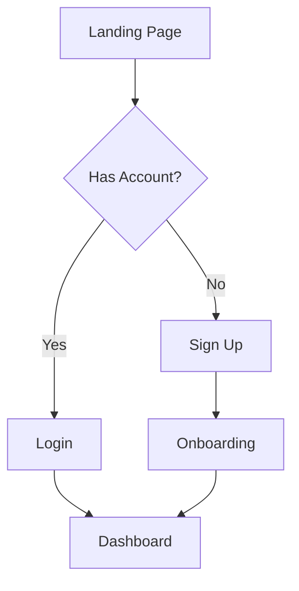
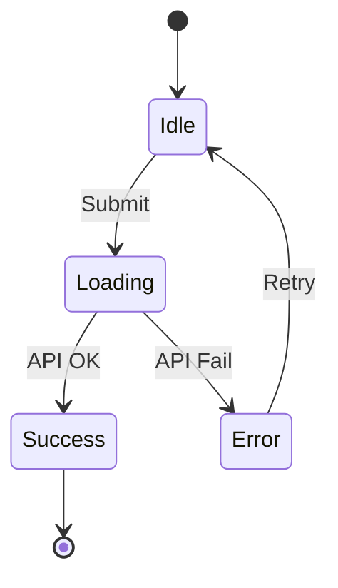
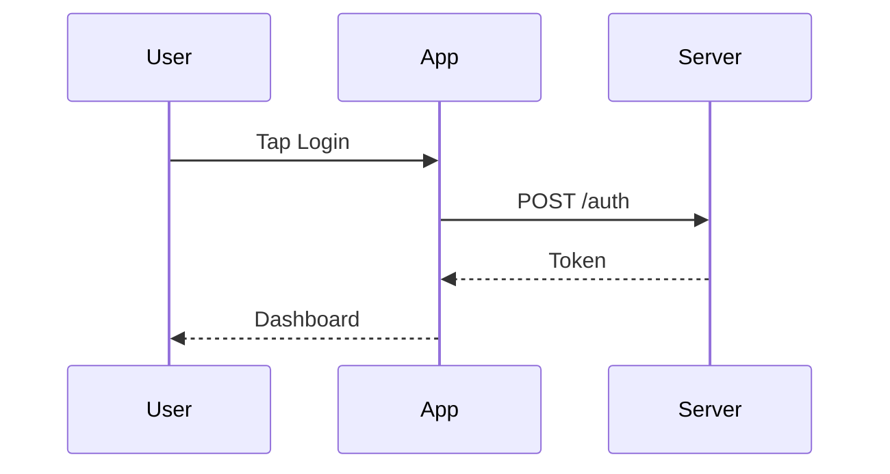

# Skill: ux-flow

Map user journeys, feature flows, and state diagrams.

## Workflow

### 1. Gather Context

Ask:
> "What flow do you want to map?"
> - **User Journey** - End-to-end user experience (e.g., onboarding, checkout)
> - **Feature Flow** - Specific feature interaction (e.g., login, upload)
> - **State Diagram** - Component/screen states (e.g., button states, form states)
> - **Navigation Flow** - App navigation structure

Then ask:
> "Describe the flow in a few sentences, or paste any existing requirements."

### 2. Identify Flow Elements

Based on user input, identify:
- **Entry points** - Where does the user start?
- **Decision points** - Where do paths branch?
- **Actions** - What does the user do?
- **Outcomes** - Success, error, edge cases?
- **Exit points** - Where does the flow end?

### 3. Generate Mermaid Diagram

Create appropriate diagram type:

**User Journey (flowchart):**


**State Diagram:**


**Sequence Diagram (for interactions):**


### 4. Add Annotations

Include with the diagram:
- **Happy path** - Highlighted main flow
- **Edge cases** - Error handling, empty states
- **Notes** - Key decisions, assumptions

### 5. Save & Present

```bash
# Ensure directory exists
mkdir -p .waramity/design/ux-flows

# Save flow diagram
# File: .waramity/design/ux-flows/[flow-name].md
```

**Output format:**
```markdown
# UX Flow: [Flow Name]

Generated: YYYY-MM-DD

## Overview
[Brief description of what this flow covers]

## Diagram

\`\`\`mermaid
[Mermaid diagram code]
\`\`\`

## Flow Steps

1. **[Step Name]** - [Description]
   - User action: [What user does]
   - System response: [What happens]

2. **[Step Name]** - [Description]
   ...

## Edge Cases

| Scenario | Handling |
|----------|----------|
| [Edge case] | [How it's handled] |

## Notes

- [Key decisions]
- [Assumptions]
- [Dependencies]
```

---

## Diagram Types Reference

| Type | Use When | Mermaid Syntax |
|------|----------|----------------|
| Flowchart | Multi-step processes, decisions | `flowchart TD` |
| State Diagram | Component states, transitions | `stateDiagram-v2` |
| Sequence | User-system interactions | `sequenceDiagram` |
| Journey | User experience mapping | `journey` |

---

## Rules

- Always clarify the flow scope before generating
- Include both happy path and edge cases
- Use consistent node naming
- Keep diagrams readable (max ~15 nodes per diagram)
- Split complex flows into sub-diagrams
- This skill is independent - no brand-kit required
- Wireframe skill can reference these flows
